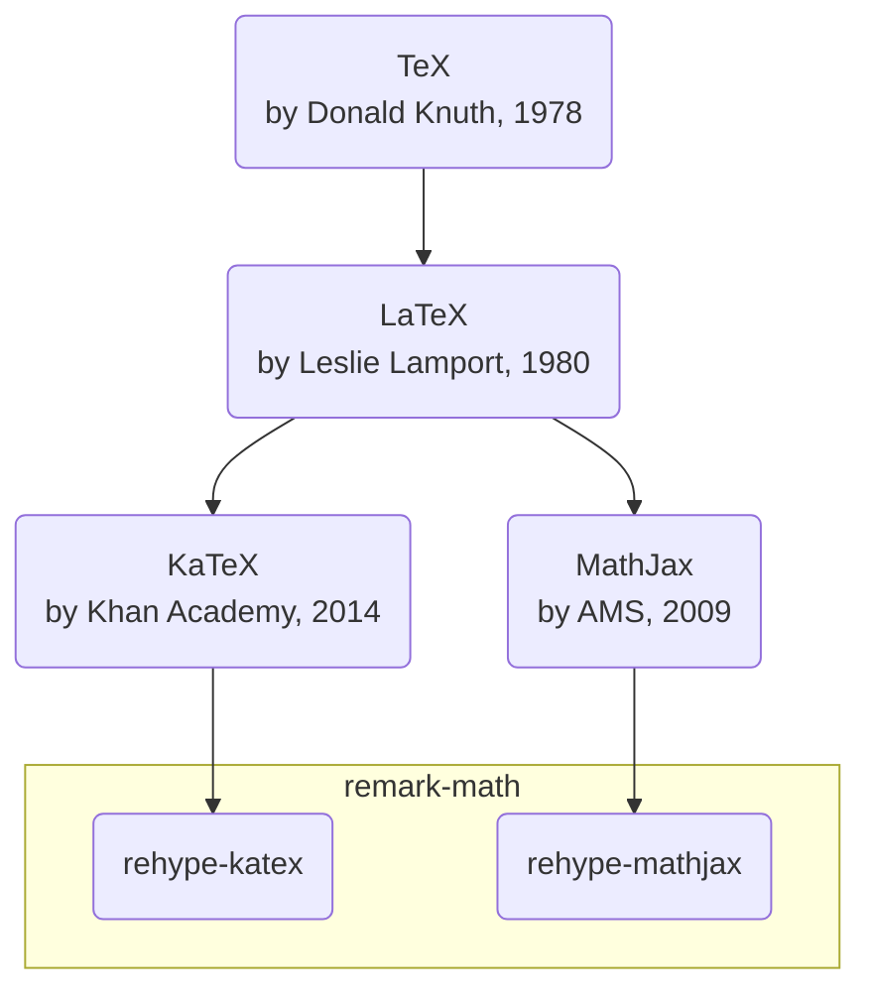

# LaTeX：数学公式排版

学术文档需要更专业的排版效果，特别是数学公式的渲染。[LaTeX](https://www.latex-project.org/)是一种专业的学术文档排版系统，它的特点是：
- 与Markdown相似，强调样式与内容分离
- 专注于数学公式、科技文档
- 语法复杂，但功能强大
- 渲染效果专业、美观
- 可生成高质量的PDF文档

LaTeX的发展历程如下：

我们经常使用的数学公式渲染引擎有：
- [KaTeX](https://katex.org/): 性能优异，但兼容性略差，只支持常用LaTeX语法
- [MathJax](https://www.mathjax.org/): 完整兼容LaTeX，功能丰富，但性能较差

| 渲染引擎 | KaTeX | MathJax |
| :-- | :-- | :-- |
| 性能 | 高 | 低 |
| 体积 | 小 | 大 |
| 兼容性 | 低 | 高 |
| 功能 | 有限 | 丰富 |

> 如需Tikz语法支持（如电路图、化学结构式、费曼图等），推荐使用MathJax；其它简单数学公式，使用KaTeX即可

这两种引擎的公式渲染效果样例如下：
- [KeTeX公式渲染效果样例](./latex-katex.md)
- [MathJax公式渲染效果样例](./latex-mathjax.md)
