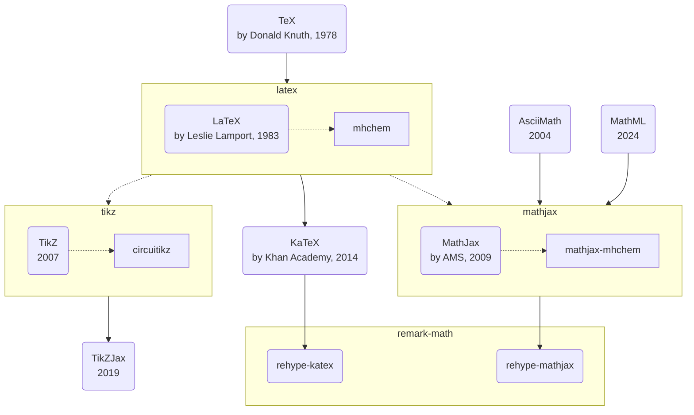

# LaTeX：数学公式排版

[LaTeX](https://www.latex-project.org/)是一种专业的学术文档排版系统，它的特点是：
- 与Markdown相似，强调样式与内容分离
- 尤其适合数学公式排版，渲染效果专业、美观
- 语法较复杂，但扩展性好，插件生态丰富

上图是LaTeX的技术发展历程：
- LaTeX比AsciiMath和MathML生态更完善
  - [AsciiMath](http://asciimath.org/): 语法简洁易读，但功能较弱，不支持复杂数学公式
  - [MathML](https://w3c.github.io/mathml/): W3C标准，浏览器可直接渲染，但语法冗长，不适合直接手写，兼容性差
- KaTeX和MathJax是LaTeX的两种渲染引擎
  - [KaTeX](https://katex.org/): 性能优异，但兼容性略差，只支持常用LaTeX语法
  - [MathJax](https://www.mathjax.org/): 完整兼容LaTeX，功能丰富，但性能较差
- [TikZ](https://texample.net/tikz/):是LaTeX的绘图工具

| 渲染引擎 | KaTeX | MathJax | MathML |
| :-- | :-- | :-- | :-- |
| 性能 | 高 | 低 | 高 |
| 体积 | 小 | 大 | 无 |
| 兼容性 | 低 | 高 | 低 |
| 功能 | 有限 | 丰富 | 有限， |
| 语法 | 复杂 | 复杂 | 冗长，不适合手写 |

> 选型建议
> - 如希望完整的LaTeX语法或支持mdchem插件，推荐使用MathJax
> - 其它简单数学公式，使用KaTeX即可
> - 不希望任何渲染引擎，可直接使用MathML

这几种引擎的公式渲染效果样例如下：
- [KeTeX公式渲染效果样例](./latex-katex.md)
- [MathJax公式渲染效果样例](./latex-mathjax.md)
- [MathML公式渲染效果样例](./latex-mathml.md)
- [TikZ绘图渲染效果样例](./latex-tikz.md)
