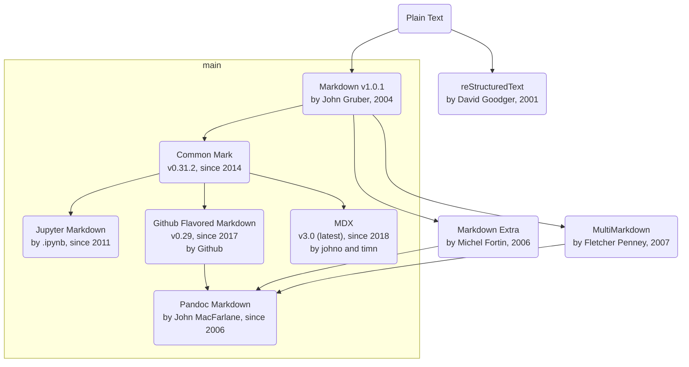

# Markdown：从极简主义，到包罗万象

## Markdown简介

Markdown是一种[轻量级标记语言(LML)](https://en.wikipedia.org/wiki/Lightweight_markup_language)，它的特点是：
- 重内容创作，轻样式排版
- 人类阅读书写友好，学习和使用简单
- 流行度高，社区支持广泛，工具丰富，扩展性强
- 可渲染为HTML网页，便于发布和展示

Markdown比较适合的创作场景有：
- 电子书、开发文档
- 技术博客、静态内容网站
- 个人笔记

## Markdown方言

- [Markdown v1.0.1 by John Gruber (2004)](https://daringfireball.net/projects/markdown/)
    - 最原始的Markdown语法，功能比较少，缺乏标准化
- [Pandoc Markdown by John MacFarlane, since 2006](https://pandoc.org/MANUAL.html#pandocs-markdown)
    - 通用文档转换工具Pandoc的Markdown方言，支持更多的功能和扩展
    - 适合于多种文档格式的转换和发布
- [CommonMark v0.31.2 (latest), since 2014](https://commonmark.org/)
    - 标准化的Markdown语法，功能不多，但兼容性好，已被广泛支持
- [Github Flavored Markdown, since 2017](https://github.github.com/gfm/)
    - 非常流行的Markdown方言，功能较多，扩展性好
    - 适合于开源项目的文档编写和展示
- [Juptyer Notebook Markdown, since 2011](https://jupyter.org/)
    - 适合于数据科学领域的文档编写，支持交互式计算和数据可视化
    - 适合于数据分析和机器学习的实验和展示
- [MDX v3.0, since 2018](https://mdxjs.com/)
    - 可支持动态交互组件的Markdown方言，扩展性好
    - 适合于静态内容网站的构建和部署，允许嵌入交互式组件

> 我们通常使用 **CommonMark** 作为Markdown标准，并采用 **GFM** 作为其语法扩展，以支持更多功能。在特定应用领域， **Jupiter Notebook Markdown** 和 **MDX** 也有各自的适用场景。

## Markdown语法及功能

remark和markdown-it是两个比较流行的Markdown解析器：

| 主要特性 | `remark` | `markdown-it` |
| :-- | :--| :-- |
| 设计理念 | 可组合的AST解析器 | 传统的Markdown解析器 |
| 解析方式 | 先解析为AST（支持转换和修改） | 直接渲染为网页 |
| 主要用途 | 渲染流水线 | 直接渲染为网页 |
| 可扩展性 | 丰富的插件系统 | 可通过插件扩展（解析时） |
| 标准化支持 | 依赖插件实现 | 100%支持CommonMark |
| 处理性能 | 速度稍慢 | 速度快 |
| 社区生态 | 可与rehype生态集成 | - |

> 推荐用`remark`作为解析器，以支持更多的功能和扩展性。
> - [remark插件集](https://unifiedjs.com/explore/keyword/remark/)
> - [rehype插件集](https://unifiedjs.com/explore/keyword/rehype/)

### 文本、图片和链接

| 行内嵌 | 语法 | cmark | gfm | remark |
| :-- | :-: | :-: | :-: | :-: |
| 标题 | # `heading` | ✅ | ✅ | ✅ |
| 正文 | `plain-text` | ✅ | ✅ | ✅ |
| 加粗 | \*\*`text`\*\*, \_\_`text`\_\_ | ✅ | ✅ | ✅ |
| *斜体* | \*`text`\*, \_`text`\_ | ✅ | ✅ | ✅ |
| ~~删除线~~ | \~\~`text`\~\~ | ✅ | ✅ | ✅ |
| `代码` | \``code`\` |✅ | ✅ | ✅ |
| [超链接](https://www.microsoft.com) | \[`text`](`url`) | ✅ | ✅ | ✅ |
| `图片` | !\[`alt`](`url`) | ✅ | ✅ | ✅ |
| HTML | *直接嵌入* | ✅ | ✅ | ✅ |
| :smile: | \:`emoji`\: | ❌ | ✅ | `remark-gemoji` |
| `自动链接` | *裸链接url* | ❌ | ✅ | `remark-gfm` |
| `引用链接` | *自动转换* | ❌ | ❌ | `remark-reference-links` |
| ==高亮== | \==`text`\== | ❌ | ❌ | `remark-highlight` |
| 脚注[^1] | `text`\[^`#`] | ❌ | ❌ | `remark-footnotes` |

> CommonMark和GFM可用内嵌`[1](#footnote1)`搭配`
1. 脚注内容
`来实现脚注的效果。

### 列表、表格与文本块

| 多行文本 | 语法 | cmark | gfm | remark |
| :-- | :-: | :-: | :-: | :-: | 
| `无序`列表 | - `item` | ✅ | ✅ | ✅ |
| `有序`列表 | 1. `item` | ✅ | ✅ | ✅ |
| `任务`列表 | - [ ] `todo`, - [x] `done` | ❌ | ✅ | `remark-gfm` |
| `定义`列表 | `术语`: `解释` | ❌ | ❌ | `remark-definition-list` |
| `表格` | `制表符` \|  |❌ | ✅ | `remark-gfm` |
| `引用`块 | > `block` | ✅ | ✅ | ✅ |
| `代码`块 | \`\`\` `block` \`\`\` | ✅ | ✅ | ✅ |
| `可折叠`块 | \
`content`\
 | ❌ | ❌ | `remark-details` |

### 图表

| Mermaid | 语法 | cmark | gfm | remark |
| :-- | :-: | :-: | :-: | :-: |
| `流程图` | \`\`\` `mermaid` \`\`\` | ❌ | ❌ | `remark-mermaid` |
| `时序图`  | \`\`\` `mermaid` \`\`\` | ❌ | ❌ | `remark-mermaid` |
| `状态流图` (UML) | \`\`\` `mermaid` \`\`\` | ❌ | ❌ | `remark-mermaid` |
| `实体关系图` (UML) | \`\`\` `mermaid` \`\`\` | ❌ | ❌ | `remark-mermaid` |
| `类图` (UML) | \`\`\` `mermaid` \`\`\` | ❌ | ❌ | `remark-mermaid` |
| `包图（消息结构）` | \`\`\` `mermaid` \`\`\` | ❌ | ❌ | `remark-mermaid` |
| `架构图` | \`\`\` `mermaid` \`\`\` | ❌ | ❌ | `remark-mermaid` |
| `git图` | \`\`\` `mermaid` \`\`\` | ❌ | ❌ | `remark-mermaid` |
| `思维导图` (beta) | \`\`\` `mermaid` \`\`\` | ❌ | ❌ | `remark-mermaid` |
| `时间线` (beta) | \`\`\` `mermaid` \`\`\` | ❌ | ❌ | `remark-mermaid` |
| `甘特图` | \`\`\` `mermaid` \`\`\` | ❌ | ❌ | `remark-mermaid` |
| `看板` | \`\`\` `mermaid` \`\`\` | ❌ | ❌ | `remark-mermaid` |
| `饼状图` | \`\`\` `mermaid` \`\`\` | ❌ | ❌ | `remark-mermaid` |
| `四象限图` | \`\`\` `mermaid` \`\`\` | ❌ | ❌ | `remark-mermaid` |
| `折线（柱状）图` | \`\`\` `mermaid` \`\`\` | ❌ | ❌ | `remark-mermaid` |

> [Mermaid](https://https://mermaid.js.org/)是一个在markdown生态里非常流行的绘图工具。

| 其它图表 | 语法 | cmark | gfm | remark |
| :-- | :-: | :-: | :-: | :-: |
| `tikz图` | - | ❌ | ❌ | `tikzjax` |
| `dot图` | - | ❌ | ❌ | `remark-graphviz` |

### 公式

| 公式 | 语法 | cmark | gfm | remark |
| :-- | :-: | :-: | :-: | :-: |
| 内联`公式` | \$`latex`\$ | ❌ | ❌ | `remark-math` |
| `公式`块 | \$\$`letax`\$\$ | ❌ | ❌ | `remark-math` |
| `KaTeX`引擎 | `latex` | ❌ | ❌ | `rehype-katex` |
| `MathJax`引擎	| `latex` | ❌ | ❌ | `rehype-mathjax` |
| `化学结构式` | `smiles` | ❌ | ❌ | `rehype-smiles` |
| `五线谱` | `abc` | ❌ | ❌ | `remark-abcjs` |

[Katex](https://katex.org/)和[MathJax](https://www.mathjax.org/)是两种广泛使用的LaTeX公式渲染引擎：
- Katex的渲染性能更好，支持的LaTeX语法略少
    - [Supported Functions](https://katex.org/docs/supported.html)
    - [Supported Tables](https://katex.org/docs/support_table)
- MathJax对LaTeX支持更全面，但渲染性能不如Katex
    - 除LaTeX外，还支持MathML和AsciiMath
    - 加载和渲染都比较慢，体积庞大

> 建议：默认采用Katex作为公式渲染引擎，以提高性能和用户体验。

### 其它

| 其它 | 语法 | cmark | gfm | remark |
| :-- | :-: | :-: | :-: | :-: |
| HTML转换 | - | ❌ | ❌ | `remark-rehype` |
| TOC目录 | - | ❌ | ❌ | `remark-toc` |
| YAML元数据 | - | ❌ | ❌ | `remark-frontmatter` |
| 阅读时间 | - | ❌ | ❌ | `remark-readtime` |

## Markdown资源

### 文档

| 资料 | 说明 |
| :-- | :-- |
| [Markdown Cheatsheet](https://github.com/lifeparticle/Markdown-Cheatsheet) | Markdown语法速查表 |
| [Markdown Guide](https://www.markdownguide.org/) | Markdown语法指南 |

### 工具

| 工具 | 说明 |
| :-- | :-- |
| [Markdown Preview Enhanced](https://marketplace.visualstudio.com/items?itemName=shd101wyy.markdown-preview-enhanced) | VSCode插件，支持Markdown的预览和导出 |
| [Astro](https://astro.build/) | 用于构建静态内容网站的工具，支持Markdown和MDX等格式 |
| [Slidev](https://sli.dev/) | 用于制作幻灯片的Markdown工具，支持多种主题和插件，提供VSCode插件 |
| [Pandoc](https://pandoc.org/) | 通用文档转换工具（命令行），支持将Markdown转换为PDF等多种输出格式 |
| [Jupiter Notebook](https://jupyter.org/) | 用于数据科学的交互式文档工具，支持Markdown和代码混合书写 |

| Chat AI | 说明 |
| :-- | :-- |
| [ChatGPT](https://chat.openai.com/) | 可广泛支持对各种Markdown方言和扩展的理解和生成 |
| [Deepseek](https://chat.deepseek.ai/) | 同上 |
| [Github Copilot](https://copilot.github.com/) | 同上 |

> 均可生成Markdown文档，支持代码、Mermaid和LaTeX公式等。