# Mermaid：让枯燥的文字秒变炫酷图表

## 介绍

与Markdown的宗旨非常相似，[Mermaid](https://mermaid-js.github.io/mermaid/#/)是一种用于描述图表的轻量级文本标记语言。

Mermaid的特点是：
- 简单好用，只需几行文本即可绘制出复杂的图表
- 与Markdown集成方便，增强文档的表现力
- 除最常用的流程图外，还支持十多种各式图表

| 用途 | 图表类型 |
| :-- | :-- |
| 软件开发 | [流程图](#流程图)、[时序图](#时序图)、[状态流图](#状态流图)、[实体关系图](#实体关系图)、[类图](#类图)、[消息结构图](#消息结构图)、[架构图](#架构图)、[Git分支图](#git分支图) |
| 日程计划 | [思维导图](#思维导图)、[时间线](#时间线)、[甘特图](#甘特图)、[看板](#看板) |
| 数据分析 | [饼图](#饼图)、[四象限图](#四象限图)、[折线图和柱状图](#折线图和柱状图)、[桑基图](#桑基图) |

## 效果展示

*用于测试Astro的展示效果*

### 软件开发

#### 流程图

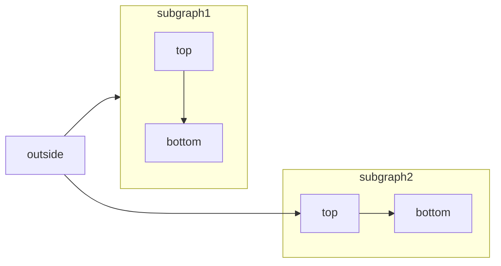

#### 时序图

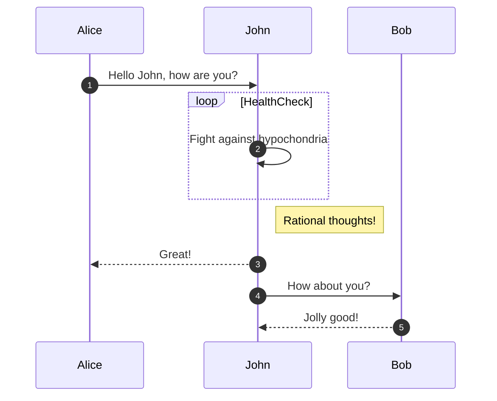

#### 状态流图

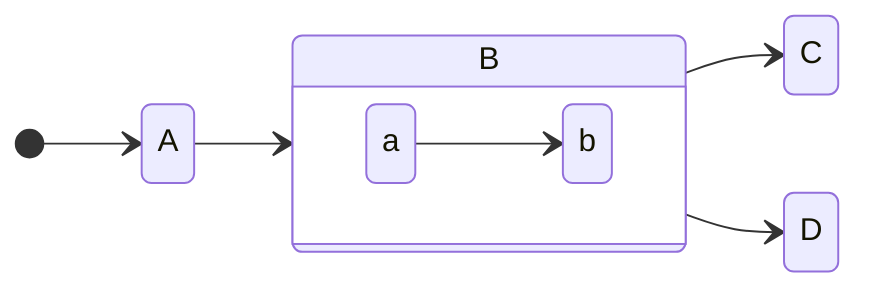

#### 实体关系图

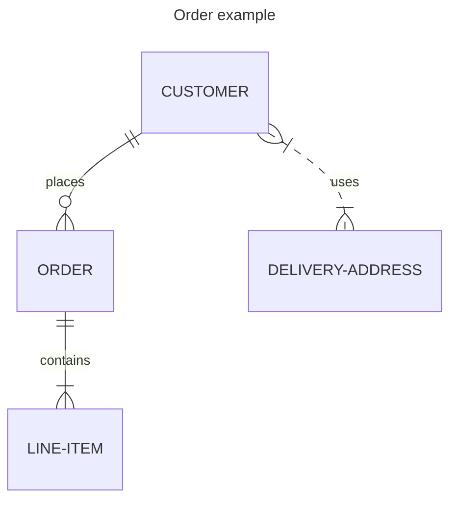

#### 类图

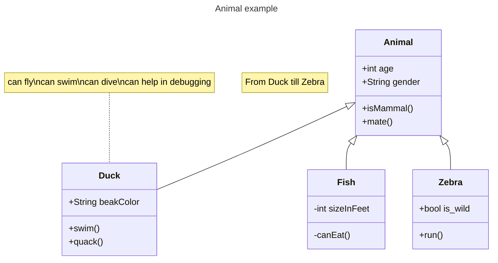

#### 消息结构图

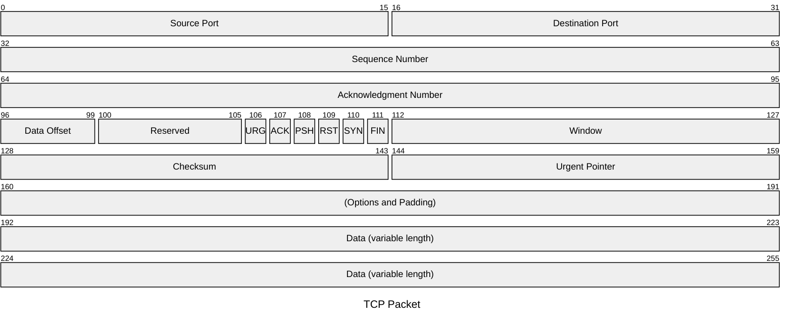

> 注意：默认不适合深色背景主题

#### 架构图

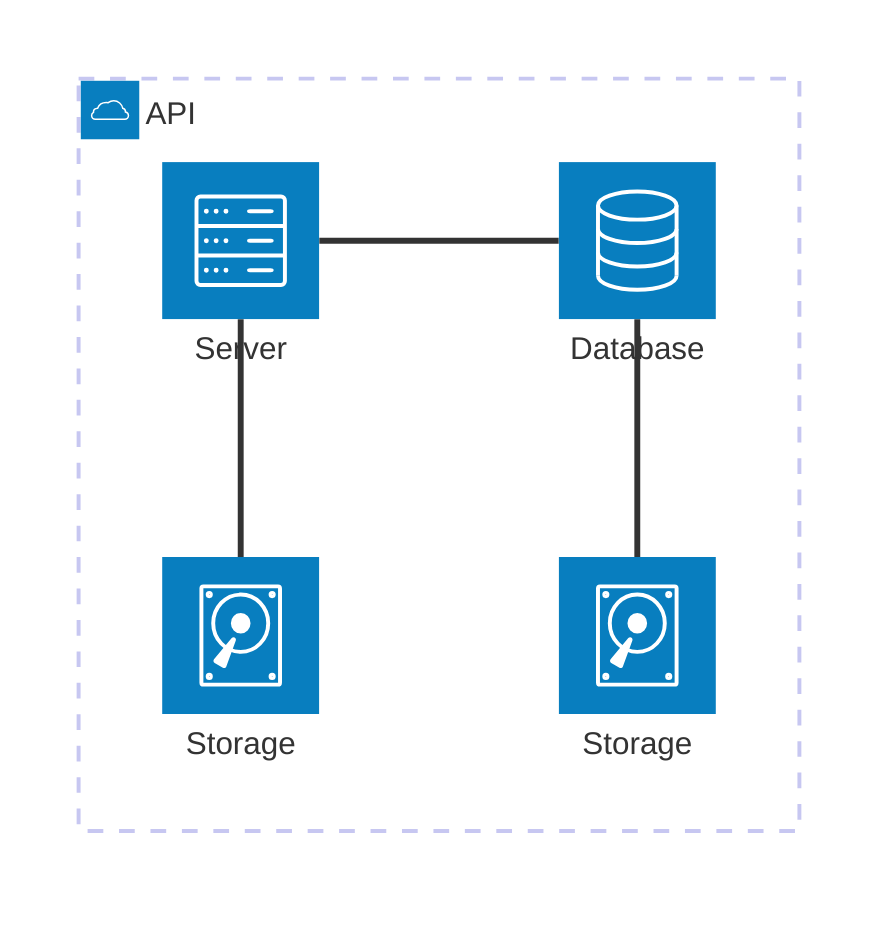

#### Git分支图

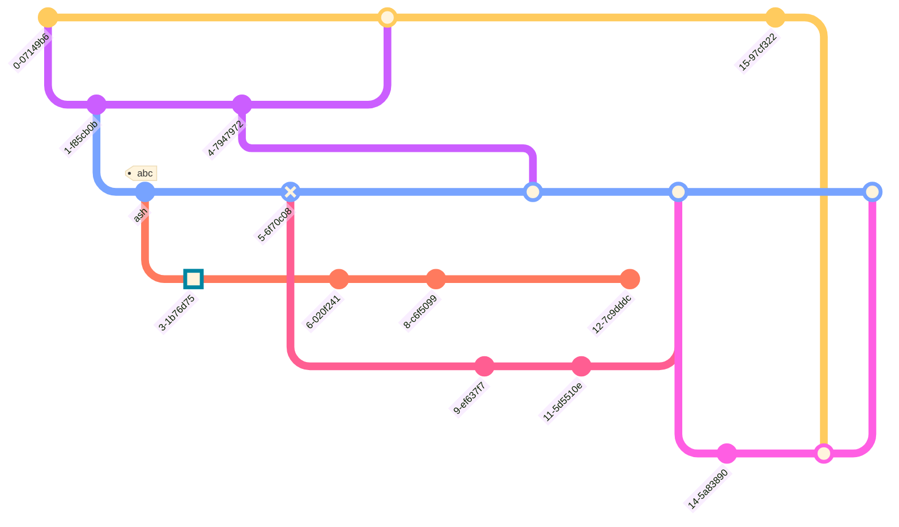

### 日程计划

#### 思维导图

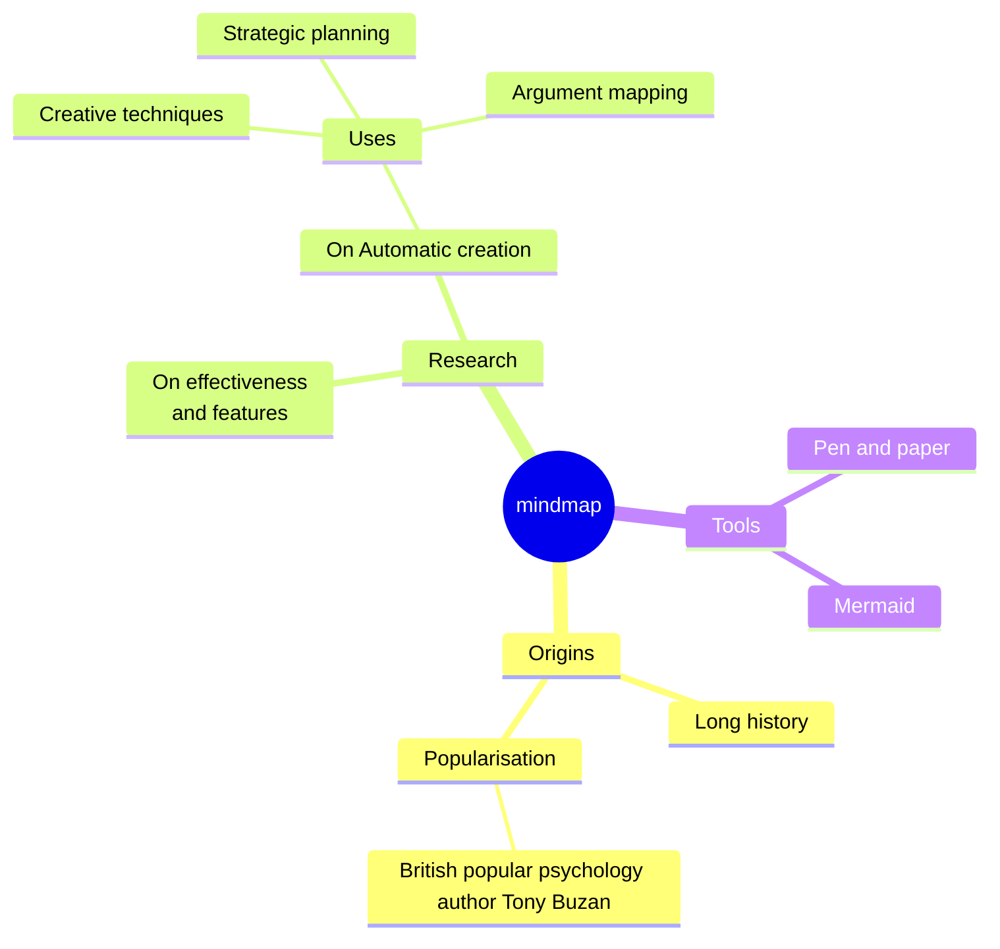

#### 时间线

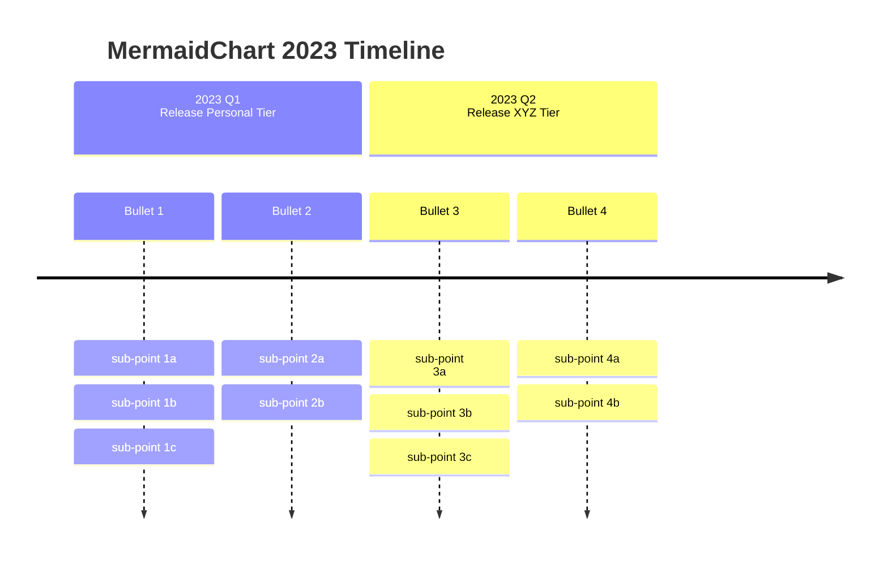

#### 甘特图

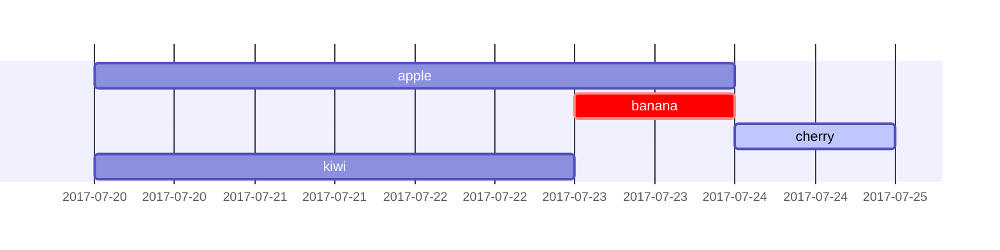

#### 看板

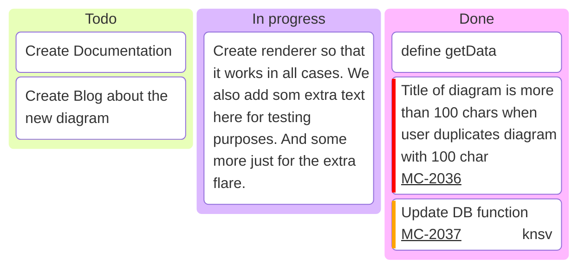

### 数据分析

#### 饼图

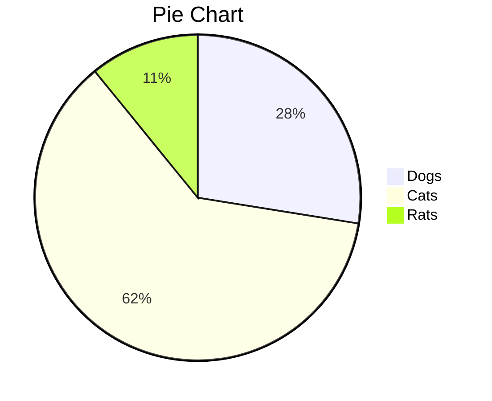

#### 四象限图

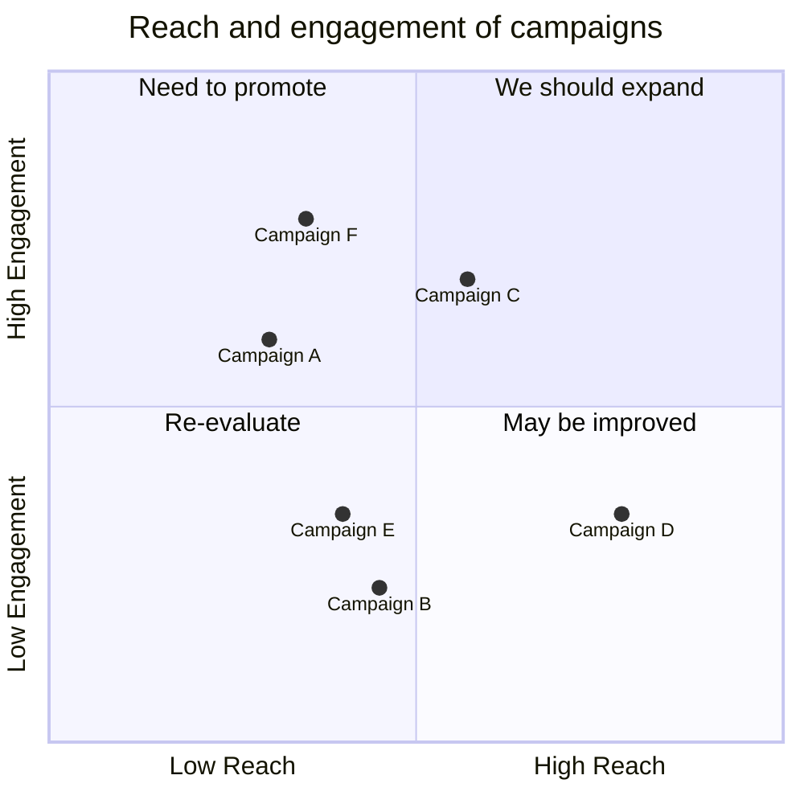

#### 折线图和柱状图

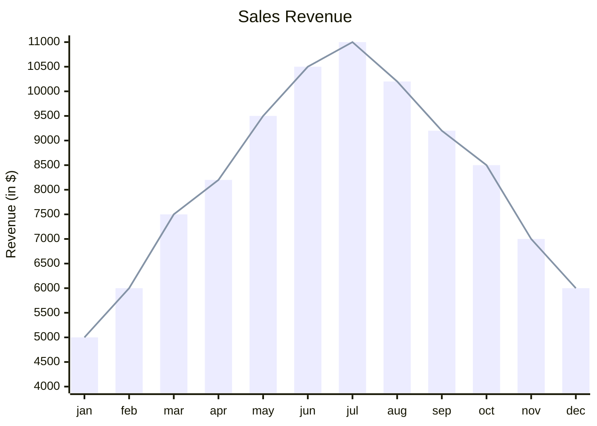

#### 桑基图

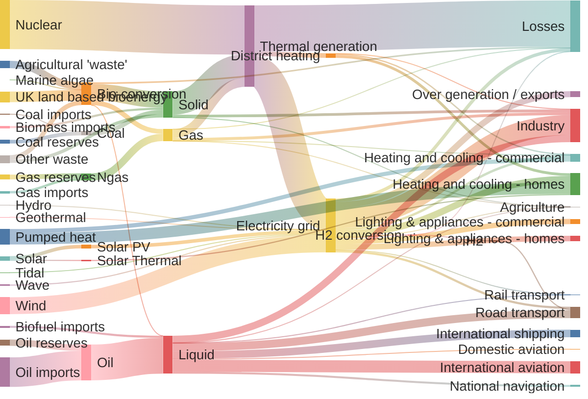

> 注意：默认不适合深色背景主题
