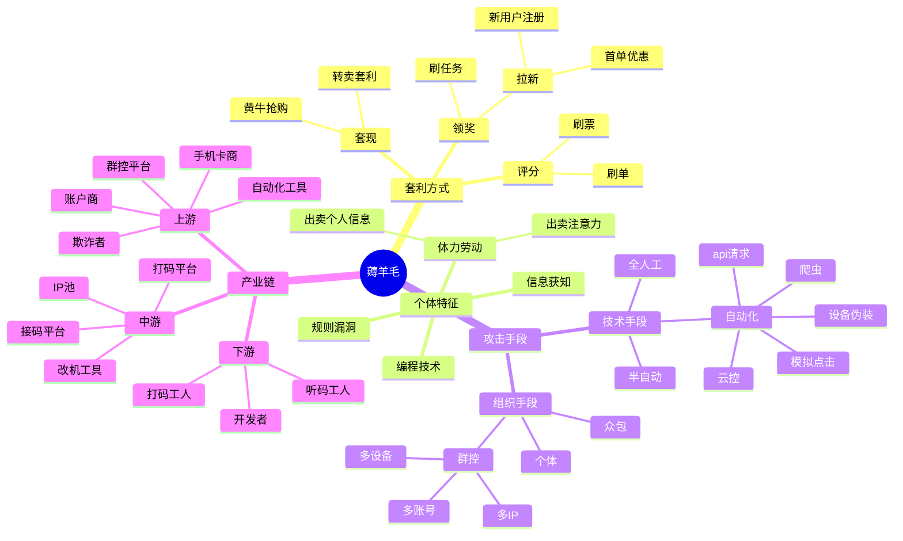
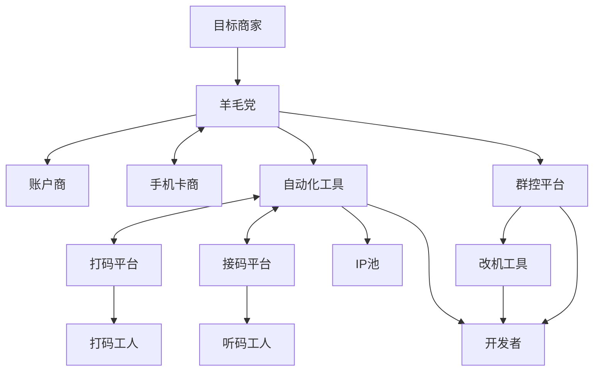
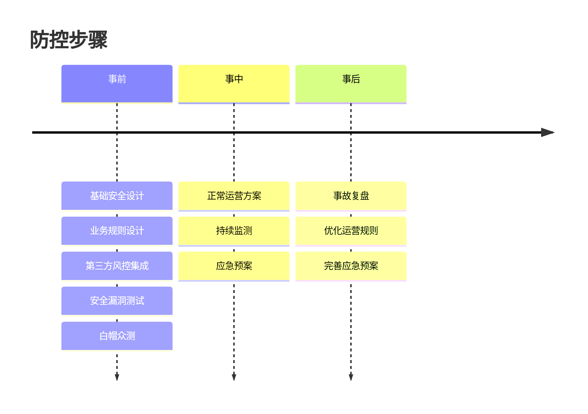
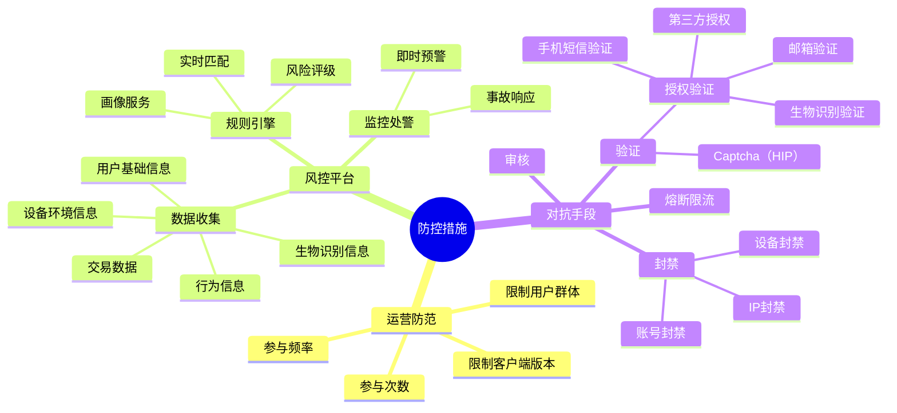
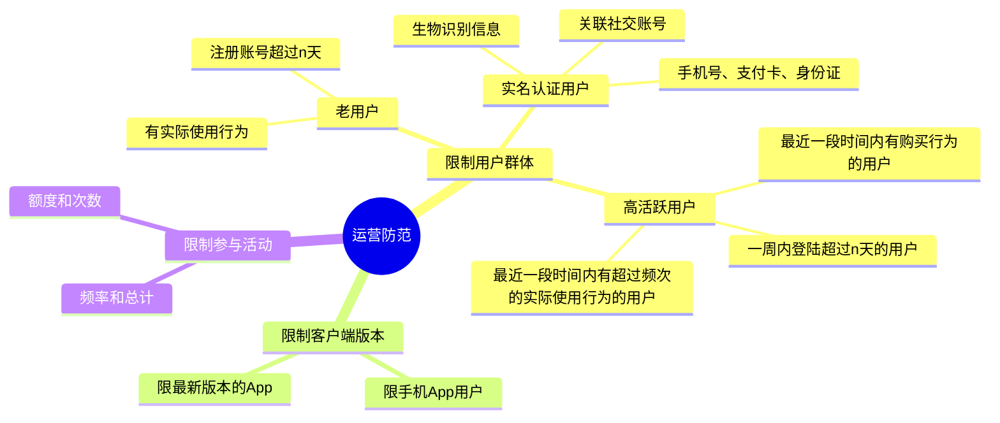
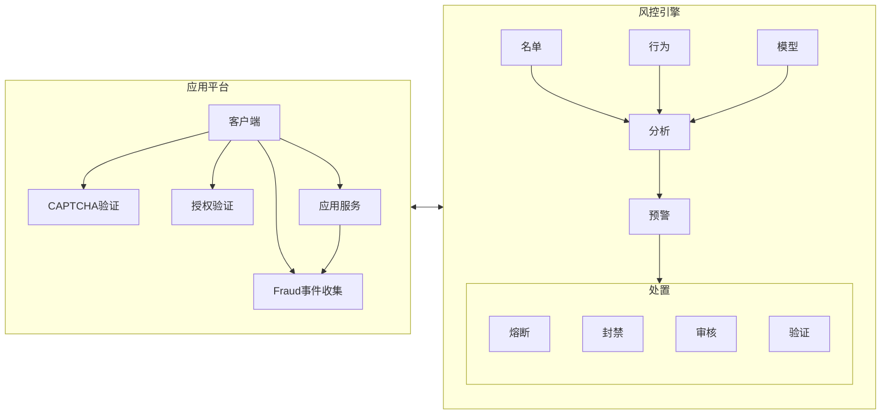

# 风控平台

怎么防范“薅羊毛”？反欺诈技术的学习与整理...

---

# 薅羊毛

---

# 产业链

---

# 产业链

- 目标商家：被欺诈者的目标，通常是电商、金融、社交等互联网平台。
- 羊毛党：非法获得平台优惠、奖励、积分等资源的欺诈者。
- 手机卡商：提供大量未实名或临时手机卡，作为接收短信验证码的基本资源。
- 账户商：收集和整合批量注册出来的虚假账号，再将这些账号打包出售给需要虚假流量的买家。
- 自动化工具：模拟键盘或触屏操作，自动执行重复性操作，如批量注册、刷单等任务。
- 群控系统：集中控制大量真机或模拟设备，实现同步自动化操作，极大提升大规模欺诈执行效率。
- 接码平台：通过自动化接口收集手机卡接收到的短信验证码，并将其转发给下游欺诈者。
- 打码平台：利用人工或机器学习技术自动破解各种验证码，帮助绕过网站安全验证。
- IP池：提供大量IP地址，用于伪装欺诈者的真实身份，规避平台风控。
- 改机工具：通过修改设备标识（如IMEI、MAC等）使同一物理设备表现为多个独立设备，规避设备级风控。
- 开发者：负责设计、开发和维护自动化工具、脚本及插件，为整个产业链提供技术支持和持续迭代。
- 听码人员：通过人工监控短信，及时获取验证码补充自动化系统，确保注册流程的顺利完成。
- 打码工人：通过人工识别验证码，为欺诈者提供验证码识别服务，帮助绕过网站安全验证。

---

# 防控步骤

--- 

# 防控步骤

---

# 防控措施

---

# 运营防范

---

# 总体流程

---
layout: full
---

---

# 关联图谱

> 触黑社群发现（图聚类、关联分析）
> PageRank分析
> 图嵌入模型（低维表示）

---

# 特征工程

> - 时序分析
> - 图（网络）分析

---

# 参考资料

- [深渊背后的真相之薅羊毛报告](https://image.3001.net/uploads/pdf/4aa87c46888173995c295a873c2aa682.pdf)
- 人工智能反欺诈三部曲
  - [特征工程](https://www.weiyangx.com/236330.html)
  - [指纹、风险评估模型](https://zhuanlan.zhihu.com/p/27065602)
  - 关联图谱：[上](https://zhuanlan.zhihu.com/p/38078191)、[下](https://zhuanlan.zhihu.com/p/38837595)
- 网易云盾
  - [智能风控引擎业务架构](https://dun.163.com/product/risk-engine)
  - [全链路风控解决方案深度解读](https://zhuanlan.zhihu.com/p/84747637)
- [拒绝羊毛党：运营同学必看的防薅羊毛技术完全解读](https://www.woshipm.com/operate/3150544.html)
