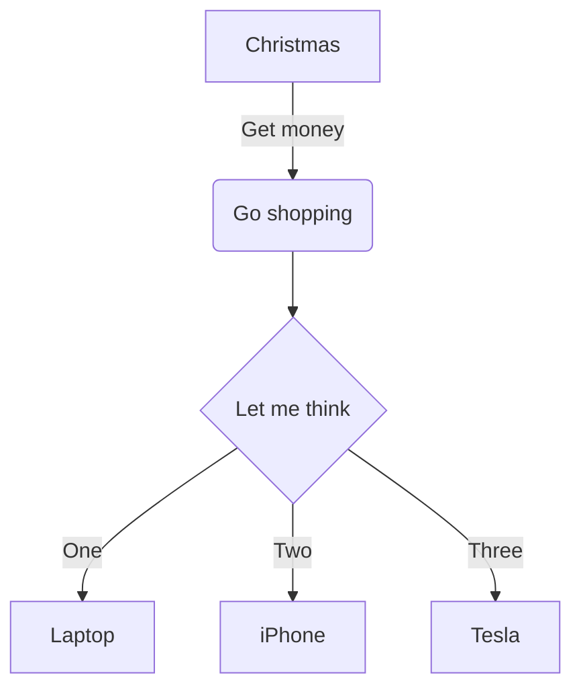
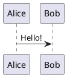

# Hi, Slidev

基于Markdown的幻灯片制作工具

---

# 特色

- 直接用Markdown编写，关注内容而非样式，简单易学
- 支持表格、代码高亮、KaTeX数学公式和Mermaid图形，排版美观
- 实时预览，所见即所得，创作效率高
- 丰富的社区主题和插件，内置Vue组件扩展功能，满足个性化需求

---

# 工具

- 编辑器集成
  - [VSCode集成](https://marketplace.visualstudio.com/items?itemName=antfu.slidev)
- Slidev主题
  - [官方主题](https://cn.sli.dev/resources/theme-gallery)
  - [更多主题](https://www.npmjs.com/search?q=keywords:slidev-theme)
- [Slidev插件](https://www.npmjs.com/search?q=keywords%3Aslidev-addon)

--- 

# 目录

``` 
slidev/
  ├── components/       # 自定义组件
  ├── layouts/          # 自定义布局
  ├── public/           # 静态资源
  ├── setup/            # 自定义 setup / hooks
  ├── snippets/         # 代码片段
  ├── styles/           # 自定义样式
  ├── index.html        # 注入的 index.html
  ├── slides.md         # 幻灯片主入口
  └── vite.config.ts    # 扩展 vite 配置
```


---
layout: two-cols-header
---

# 布局、列表和表格

::left::

## 列表

- 无序列表
  - 列表项
  - 列表项
- 有序列表
  1. 1st 
  2. 2nd
  3. 3rd
- 任务列表
  - [x] 任务项（已完成）
  - [ ] 任务项（未完成）

::right::

## 表格

| 功能 | Slidev | marp |
| :-- | :--: | :--: |
| 表情 | ✅ | ✅ |
| Shiki代码高亮 | ✅ | ✅ |
| KaTeX公式 | ✅ | ✅ |
| MathJax公式 | ❌ | ✅ |
| Mermaid图表 | ✅ | ✅ |
| PlantUML图表 | ✅ | ❌ |

---

# 表情符号


--- 
layout: two-cols-header

---

# 代码高亮

::left::

```ts {2-3|5|all}{lines:true,startLine:1}
function add(
  a: Ref<number> | number,
  b: Ref<number> | number
) {
  return computed(() => unref(a) + unref(b))
}
```

::right::

使用代码块来高亮代码：

- 显示行号
- 高亮特定代码行
- 分段动画


--- 

# Mermaid图表



--- 

# PlantUML图表




---

# KaTeX公式

行内公式：$\sqrt{3x-1}+(1+x)^2$

块级公式：
$$
\begin{aligned}
\nabla \cdot \vec{E} &= \frac{\rho}{\varepsilon_0} \\
\nabla \cdot \vec{B} &= 0 \\
\nabla \times \vec{E} &= -\frac{\partial\vec{B}}{\partial t} \\
\nabla \times \vec{B} &= \mu_0\vec{J} + \mu_0\varepsilon_0\frac{\partial\vec{E}}{\partial t}
\end{aligned}
$$

---

# 化学方程式

$$
\displaystyle{\ce{B(OH)3 + H2O <--> B(OH)4^- + H+}}
$$

--- 

# Windi样式表和Vue组件

可以在幻灯片内容里直接使用Windi样式表和Vue组件。

<div class="p-3">
  <Tweet id="20" />
</div>
